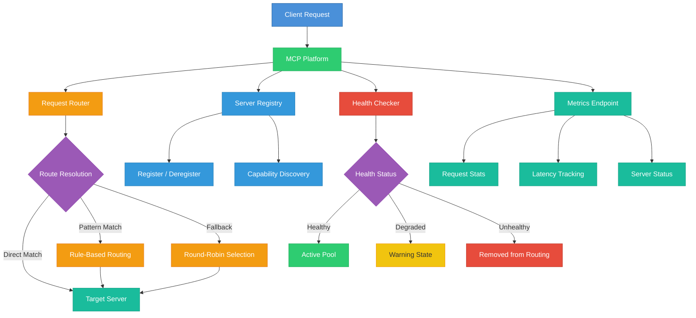

# claude-mcp-platform

MCP (Model Context Protocol) Platform Orchestrator for managing, routing, and monitoring requests across multiple MCP servers.

## Architecture



## Features

- **Server Registry** - Register and discover MCP servers with capability-based lookup
- **Request Routing** - Pattern-based routing with priority rules and fallback support
- **Health Monitoring** - Periodic health checks with automatic status management
- **Metrics Collection** - Track request counts, latency, and server availability
- **Docker Support** - Production-ready Dockerfile and docker-compose configuration

## Quick Start

### Using Bun

```bash
bun install
bun run dev
```

### Using Docker (Production)

```bash
docker-compose up -d
```

### Using Docker (Development)

```bash
# Create your local env file from the template
cp .env.example .env.dev

# Start with hot-reload
docker-compose -f docker-compose.dev.yml up --build
```

Source code is volume-mounted so changes to `src/` are picked up automatically via `bun run --watch`. A named volume is used for `node_modules` to avoid host overwrites.

## API Endpoints

| Method | Path       | Description                    |
|--------|-----------|--------------------------------|
| GET    | /health   | Platform health status         |
| GET    | /metrics  | Platform metrics               |
| GET    | /servers  | List registered servers        |
| POST   | /servers  | Register a new server          |
| POST   | /route    | Route a request to a server    |

## Configuration

| Environment Variable    | Default   | Description                     |
|------------------------|-----------|---------------------------------|
| MCP_PORT               | 3000      | Server port                     |
| MCP_HOST               | 0.0.0.0   | Server host                     |
| MCP_LOG_LEVEL          | info      | Log level                       |
| MCP_HEALTH_INTERVAL    | 30000     | Health check interval (ms)      |
| MCP_REQUEST_TIMEOUT    | 10000     | Request timeout (ms)            |
| MCP_MAX_RETRIES        | 3         | Max retry attempts              |

## License

MIT License - see [LICENSE](LICENSE) for details.
